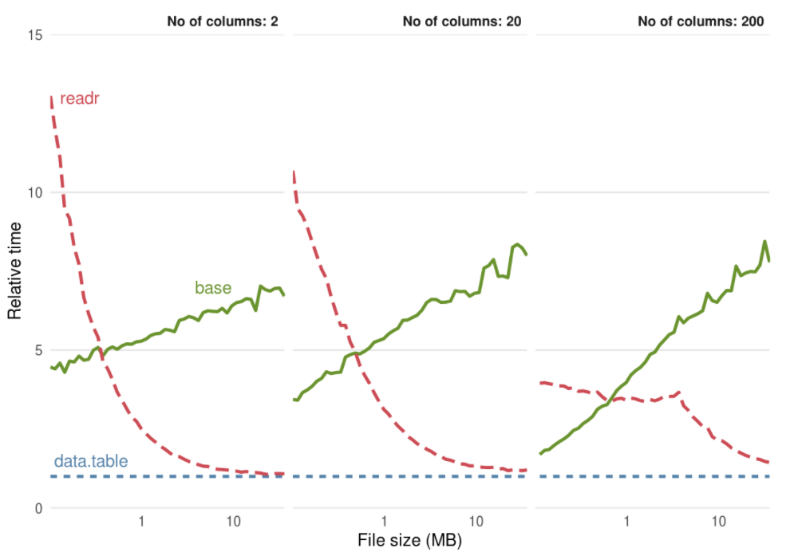
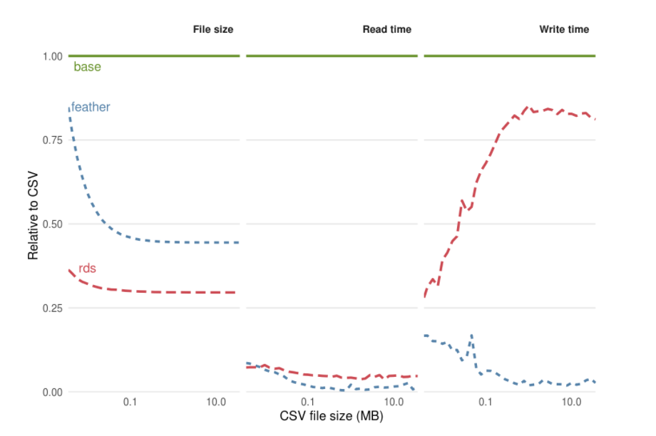

```{r setup, include=FALSE}
library(knitr)
knitr::opts_chunk$set(echo = TRUE)
opts_chunk$set(tidy.opts = list(width.cutoff = 60), tidy = TRUE)
```
> # “Progress isn't made by early risers. It's made by lazy men trying to find easier ways to do something.” ― Robert A. Heinlein


# 7 Packages/Techniques for Efficient Data Science with R
In this presentation I am going to discuss some tricks, techniques, and packages that will improve your data science game by making you and your R code more efficient.

By *efficiency* I am not just talking about algorithmic speed and data structure complexity, but I am also considering efficiency in the broader sense of the term to encompass programmer and engineering efficiency. As Gillespie and Lovelace (2016) note, *efficiency* can include programming idioms, IDEs, coding conventions, development processes, and even community support – all things that can greatly improve the speed and ease of writing and maintaining code. 

Efficiency is especially important for R - a language that is notoriously flexible in its ability to solve problems in multiple ways. This issue compounded when one considers the thousands of packages that are available on **CRAN**, **Bioconductor**, and **Github**. R's flexibility is both a blessing and curse. It is a blessing because it affords you the tools to write code specific to your individual needs. It is a curse because (a) it makes it more likely that you will choose a sub-optimal solution to your problem and (b) it makes it more likely that another scientist or team mate (and possibly your *future self*) will not understand your code, making it more difficult to maintain and extend.

In the following sections, on a case by case basis, I will briefly introduce a problem or challenge to writing effective and efficient R code. I will illustrate how these problems might be tackled in base R or other common packages. Next, I will show you what I think is a preferred solution -- one that makes for more effective and efficient code, especially in a *production* environment *collaborating* with other engineers and scientists. Rather than reinventing the wheel, I will show you what I have found are the most useful packages and techniques for solving common data science tasks balancing the needs of computational and engineering efficiency with code expressiveness.

\pagebreak

## 1. Benchmarking
In a production environment, for real-time applications, it is often important to determine the most optimal way to write a function so as to reduce processing time.

> ### What is the quickest method to subset a data.frame to a single cell?
(a). df[row, col]
(b). df[row, "col_name"]
(c). df$col_name[row]


### SOLUTION #1.1 - A naive approach is to take time stamps. The following snippet is inaccurate because it relies on a single trial and because it prints the result of the subset operation to the console (which in fact takes up the bulk of the processing time).
```{r}
df_1 <- data.frame(num = sample(x = 1:100, size = 100, replace = TRUE), 
                ltr = sample(x = letters, size = 100, replace = TRUE))

s_time <- Sys.time()
df_1[10, 2]
e_time <- Sys.time()
difftime(e_time, s_time, units = "secs")

```

### SOLUTION #1.2 - a better approach is to conduct multiple trials on each subset operation using `system.time()` with a loop around the function call. This provides a more reliable estimate of processing time.

```{r}
system.time(for (i in 1:1e4) { df_1[10, 2] })
system.time(for (i in 1:1e4) { df_1[10, "ltr"] })
system.time(for (i in 1:1e4) { df_1$ltr[10] })

```

### PREFERRED SOLUTION #1.3 - Use {microbenchmark} to benchmark small pieces of source code. Makes it easy to evaluate multiple expressions and provides easy-to-understand summary of results.

```{r}
library(microbenchmark)
(m <- microbenchmark(df_1[10, 2], df_1[10, "ltr"], df_1$ltr[10], times = 1e4))
```

### BONUS - the results of `microbenchmark()` play nicely with package {ggplot2}.
```{r}
ggplot2::autoplot(m)
```

\pagebreak

## 2. Reading Data
There are numerous ways to read/write various data formats in R. My goto these days is package {readr} because it is quick, easy to use, and has functions for reading flat files in a variety of common formats (e.g., csv, tsv, logs, tables). For large data.frames, {readr} functions approach the speeds of `data.table::fread()` (Fig. 1).




### PREFERRED SOLUTION #2.1 - Use {readr}.
```{r}
file_name <- "data/texas_census.csv"
df_2 <- readr::read_csv(file_name)

```
{readr} prints out a handy column specification that can be easily copied, pasted, and modified for a subsequent call, appropriately mapping column names to specified data types. In this example, **GEOID** shouldn't be an integer it should be a factor.


### PREFERRED SOLUTION #2.2 Use {readr} with *revised* column specification if you need to read in data multiple times (e.g., a nightly process dumps a CSV file that needs to be processed).
```{r}
lvls <- unique(df_2$GEOID)

library(readr)
df_2 <- read_csv(file_name, col_types = cols(
  GEOID = col_factor(levels = lvls), ## <- change to factor
  SUMLEV = col_character(),
  STATE = col_integer(),
  COUNTY = col_character(),
  CBSA = col_integer(),
  CSA = col_integer(),
  NECTA = col_character(),
  CNECTA = col_character(),
  NAME = col_character(),
  POP100 = col_integer(),
  HU100 = col_integer(),
  POP100.2000 = col_integer(),
  HU100.2000 = col_integer(),
  P001001 = col_integer(),
  P001001.2000 = col_integer()
))

class(df_2$GEOID)

```

Once I've preprocessed and cleaned my data.frame, I then store the data as a binary R object. This faciliates collaboration by ensuring that all team members are using *exactly the same data* (as opposed to using a CSV file that may be read and mapped differing data types). 

### PREFERRED SOLUTION #2.3 - After initial formatting, store data.frame as an R object with `saveRDS()` for subsequent I/O and to facilitate collaboration.
```{r}
  saveRDS(df_2, file = "data/texas_census_cleaned_df.Rds")
  cleaned_df_2 <- readRDS(file = "data/texas_census_cleaned_df.Rds")
```

### BONUS - Binary formats are fast! Reading and writing from binary formats is also much quicker than storing it as a CSV (Fig. 2).



\pagebreak

## 3. String Formatting
For sting formatting in base R, the most common approaches are `paste()` and `sprintf()`-- both ungainly options that make your code difficult to read and debug. 

### SOLUTION #3.1 - Use `paste()`. Makes for difficult to read code, often requiring use of different seperators to deal with sentence boundaries.
```{r}
name <- "Brandon"
age <- 45
age_units <- "years"
weight <- 162.5
weight_units <- "pounds"

paste(name, "is", age, paste0(age_units, "."), "He weighs", weight, paste0(weight_units, "!"))
```

### SOLUTION #3.2 - Use `sprintf()`. Difficult to remember formatting codes; Difficult to interpret long strings (e.g., complex SQL statement) requiring you to visually map variables at end of construct to embedded placeholders.
```{r}
sprintf("%s is %i %s. He weighs %3.1f %s!", name, age, age_units, weight, weight_units)
```

### PREFERRED SOLUTION #3.3 - Use package {glue}. Reads like a sentence, easy to interpret.
```{r}
library(glue)
glue("{name} is {age} {age_units}. He weighs {weight} {weight_units}!")
```

### BONUS - Use an environment to evaluate your variables with `glue()`.
```{r}
person <- new.env()
person$name = "Fred"
person$age = 28
person$age_units = age_units
person$weight = 185
person$weight_units = weight_units
ls(person)

glue::glue("{name} is {age} {age_units}. He weighs {weight} {weight_units}!", .envir = person)

```

\pagebreak

## 4. Complex Expressions 
> R always passes by value. It never passes by reference. There are two types of people: those who understand the preceding paragraph and those who don’t. If you don’t understand it, then R is right for you — it means that R is a safe place. - [The R Inferno (Burns, 2011)](http://www.burns-stat.com/pages/Tutor/R_inferno.pdf) 

Because R passes *by value* (rather than *by reference*), complex expressions are formed by creating (1) nested function call stacks that are difficult to interpret (because they are "read" inside-to-out), or (2) by reassigning function calls to temporary variables thus introducing the opportunity for bugs. As a typical data science example, consider an NLP data pipeline that transforms unstructured text (e.g., tweets) into a structured bag-of-words representation.


```{r}
## Define some text manipulation functions
remove_punc <- function(s) {
  gsub("[[:punct:]]","", s )
}
  
tokenize <- function(s, split_str) {
  stringr::str_split(s, split_str)
}

same_case <- function(s, case) {
  if (case == "upper") {
    toupper(s)
  } else if (case == "lower") {
    tolower(s)
  } else {
    s
  }
}

splitSubHash <- function(s) {
  #pat <- '(\\W|^)#(\\w+)'
  pat <- '(\\W|^)#([a-zA-Z]+[\\w]*)'
  sub <- "\\1HASHTAG \\2"
  gsub(pat, sub, s)
}


splitMention <- function(s) {
  pat <- "(\\W|^)(@)(\\w+)"
  sub <- "\\1MENTION \\3"
  gsub(pat, sub, s)
}

subURL <- function(s) {
  pat <- "http[s]?://(?:[a-zA-Z]|[0-9]|[$-_@.&+]|[!*\\(\\),]|(?:%[0-9a-fA-F][0-9a-fA-F]))+"
  sub <- "URL"
  gsub(pat, sub, s)
}

stripNonAscii <- function(s) {
  pat <- '[^\x01-\x7F]+'
  sub <- " "
  gsub(pat, sub, s)
}

remove_extraspaces <- function(s) {
  stringr::str_replace(gsub("\\s+", " ", stringr::str_trim(s)), "B", "b")
}


```

### SOLUTION #4.1 - Use nested functions. Extremely difficult to read.
```{r}
## Let's transform a tweet into a useable list of tokens
s <- "@foobar 'Developers who use spaces make more money than those who use tabs' https://stackoverflow.blog/2017/06/15/developers-use-spaces-make-money-use-tabs/ … #rstats "

tokenize(remove_extraspaces(remove_punc(subURL(splitSubHash(splitMention(same_case(stripNonAscii(s), case = "lower")))))), split_str = " ")
```

### SOLUTION #4.2 - Assign to temporary variables. More interpretable than nesting, but still unwieldy and easy to make mistakes.
```{r}
s1 <- stripNonAscii(s)
s2 <- same_case(s1, case = "lower")
s3 <- splitMention(s2)
s4 <- splitSubHash(s3)
s5 <- subURL(s4)
s6 <- remove_punc(s5)
s7 <- remove_extraspaces(s6)
tokenize(s7, split_str = " ")
```  
### PREFERRED SOLUTION #4.3 - Use {magrittr} pipe `%>%`. Statement read naturally from left-to-right (or top-to-bottom) by feeding output from LHS of `%>%` to 1st arg of RHS function.
```{r}

library(magrittr)

s %>% 
  stripNonAscii() %>% 
  same_case(case = "lower") %>% 
  splitMention() %>% 
  splitSubHash() %>% 
  subURL() %>% 
  remove_punc() %>% 
  remove_extraspaces() %>% 
  tokenize(split_str = " ")
```

\pagebreak

## 5. Data Munging
There are numerous functions available in base R for common data frame processing tasks like filtering, selection, and summarizing (e.g., `split()`, `subset()`, `aggregate()`). Most use standard evaluation that make for long, unwieldy statements, and the differing syntax makes them difficult to remember and they often do not play well together. 

```{r}

weapons_df <- tibble::tribble(~name,             ~weapon,
                              "Luke Skywalker",  "lightsaber",
                              "C-3PO",           "none",
                              "R2-D2",           "none",
                              "Darth Vader",     "lightsaber",
                              "Leia Organa",     "blaster",
                              "Obi-Wan Kenobi",  "lightsaber",
                              "Chewbacca",       "bowcaster",
                              "Han Solo",        "blaster",
                              "Greedo",          "blaster",
                              "Boba Fett",       "blaster")


df_5 <- dplyr::starwars
df_5 %>% head()

```
> In the Star Wars franchise, among all characters of known gender and mass GE 75, what is the difference in mean height between blaster users or lightsaber wielders?

### SOLUTION #5.1 (partial) - Using base. Complex, hard to figure out where to start with lots of opportunities for introducing bugs.
```{r}

## filter
df_5a <- df_5[!is.na(df_5$gender), ]
df_5b <- df_5a[df_5a$mass >= 75, ]

## select
df_5c <- df_5b[,c("name", "height")]

## left join
df_5c$weapon <- NA
res <- sapply(1:nrow(df_5c), function(i) {
  (nm <- df_5c$name[i])
  (idx <- which(weapons_df$name == nm))
  if (length(idx) == 0) {
    NA
  } else {
    weapons_df$weapon[idx]
  }
})

df_5c$weapon <- res


## try to summarize
tb <- table(df_5c$height, df_5c$weapon)
head(tb, n = 10)
## Ugh! Going to stop Way too complex, there has got to be a better approach!
```


### SOLUTION #5.2 (not shown) - Use {sqldf} for a straight SQL implementation. Better, but does not allow syntax checking nor does it facilitate agile interactive analysis.

### PREFERRED SOLUTION #5.3 - Use {dplyr} with {magrittr} `%>%`. Easy to read, easy to chain together expressions. Complex expressions build up in a natural sequence that facilitates interactive analysis.
```{r}
library(magrittr)
library(dplyr)

weapon_height <- df_5 %>% 
  left_join(weapons_df) %>% 
  filter(!is.na(gender) & 
           mass >= 75 & 
           weapon %in% c("blaster", "lightsaber")) %>% 
  select(name, 
         height, 
         weapon) %>% 
  group_by(weapon) %>% 
  summarize(mean_height = mean(height)) %>% 
  mutate(height_diff = 
           mean_height[weapon == "blaster"] - mean_height[weapon == "lightsaber"])

weapon_height
```

\pagebreak

## 6. Model Results
Output from various ML algorithms take myriad forms making it difficult to create data processing pipelines. 

```{r}
## Fit a model
lm_fit <- lm(Petal.Width ~ ., data = iris[,1:4])

## Fit a different model
glm_fit <- glm(am ~ wt, mtcars, family = "binomial")

## Useful summary for reading, but not so useful for computational processing
summary(lm_fit)
```
> Suppose we want to programmatically fit a model to some data and select all terms that are significant at p < 0.01 so that we can pass the terms on to some other downstream process in our data pipeline.

### SOLUTION #6.1 - Figure out the structure of the results, craft a "solution", and extend to cover all use cases (i.e. the models your pipeline will support).
```{r}
library(magrittr)
library(dplyr)
## Examine the structure of this particular output
str(lm_fit, max.level = 1, vec.length = 2, give.attr = FALSE) 

df_6 <- as.data.frame(coef(summary(lm_fit))) ## figure out how to access it
filt_df <- df_6[df_6$`Pr(>|t|)` <= 0.01, ] ## identify the appropriate column
(sig_terms <- row.names(filt_df)) ## extract terms

## Looks good, let's wrap in a function that we can apply to all model fits

get_sigterms <- function(fit) {
  df <- as.data.frame(coef(summary(fit))) ## figure out how to access it
  filt_df <- df[df$`Pr(>|t|)` <= 0.01, ] ## identify the appropriate column
  (sig_terms <- row.names(filt_df)) ## extract terms
  return(sig_terms)
}

get_sigterms(lm_fit) ## Great it works

get_sigterms(glm_fit) ## Hmmm... really no significant terms?

coef(summary(glm_fit)) ## Oh, the column has a different name... 
## better add a switch statement... (and repeat for every case)
```


### PREFERRED SOLUTION #6.2 -- Use package {broom}. Transforms disparate results into a standardized data.frame format.
```{r}
lm_fit %>% 
  broom::tidy() %>% 
  filter(p.value <= 0.01) %>% 
  select(term)

glm_fit %>% 
  broom::tidy() %>% 
  filter(p.value <= 0.01) %>% 
  select(term)
```

\pagebreak

## 7. Variable Caching
The newest technique I've added to my arsenal for writing efficient R code is variable caching. When properly done, it can drastically improve the performance of your programs and improve the user experience. The idea of caching is simple: if a computationally expensive function is called multiple times with the same arguments, you can do the computation once, and then store a local copy or cache that is quickly returned whenever that function is called with the same argument list. Package {memoise} offers an elegant, easy-to-implement solution to variable caching.

```{r}

library(microbenchmark)

my_func <- function(a1, a2) {
  Sys.sleep(.1) ## Sleep for 1/10th a second to mimic heavy computation
}
```

### SOLUTION #7.1 - Just deal with it. User has to wait **<sigh>** while heavy computations takes place.
```{r}
for (i in 1:100) {my_func("foo", "bar")}
```

### PREFERRED SOLUTION #7.2 - Use package {memoise}. Elegant, no custom code, provides mechanisms for clearing caches.
```{r}
library(memoise)

mem_my_func <- memoise(my_func)

microbenchmark(my_func("foo", "bar"),mem_my_func("foo", "bar") )

## Bonus you can use Google Drive or Drop Box to share the cache among colleagues
# gdc <- cache_filesystem("~/Google Drive/.rcache")
# mrunif <- memoise(runif, cache = gdc)
# mrunif(20) # Results stored in Google Drive .rcache folder which will be synced between computers.

```
\pagebreak

## Thank you

For more information on writing efficient R code, I direct you to Gillespie and Lovelace's excellent book [Efficient R Programming (2016)](http://shop.oreilly.com/product/0636920047995.do) published by O'Reilly Media. You can read my full review of their book on RStudio's [R Views Blogs](https://rviews.rstudio.com/2017/05/19/efficient_r_programming/).

**Brandon C Loudermilk - b.c.loudermilk@gmail.com or loudermilk.brandon@heb.com**


