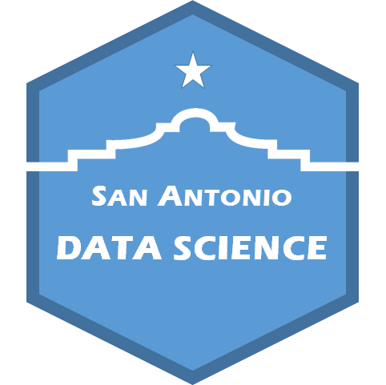

```{r setup, include=FALSE}
knitr::opts_chunk$set(echo = TRUE)
```
<div style="text-align:center" markdown="1">

</div>


## San Antonio Data Science 

Here you will find information on upcoming events of interest to the San Antonio data science and analytics community. You will also find resources (like slide decks, code snippets, and data sets) from past meetup events that we've hosted.

### Upcoming events

Date/Location TBD - Meghann Agarwal, a data scientist at Curb (Home Energy Management), will be giving a hands-on workshop on MapReduce/Hadoop/Spark. She's requested that participants sign up for the [Databricks Community Edition](https://community.cloud.databricks.com/login.html) before the talk.


### Resources from past events

[Efficient Data Science with R](efficient-data-science/efficient-data-science.html), 6/22/17, Brandon Loudermilk